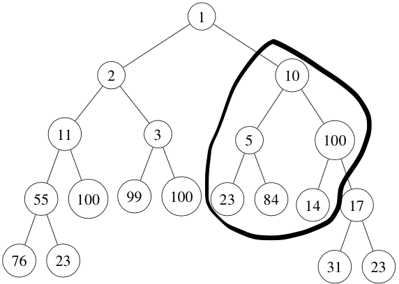
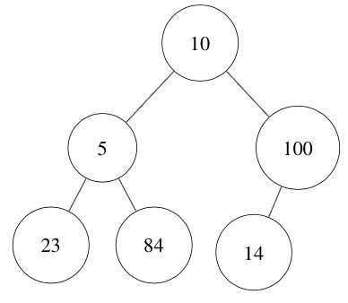
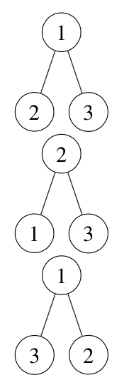

# HW16. Mutually Contained Binary Trees.


**Please read the entire file before you ask any question.**

In this assignment you will compare two Binary trees and check if they are mutually contained in each other
(i.e. all values of the first tree are present in the second tree and all values of the second tree are present in the first tree). You will first check if the first tree is contained in the second tree (i.e. all values of the first tree are present in the second tree). Then you will check if the second tree is contained in the first tree (i.e. all values the second tree are present in the first tree). If both are true, then you have mutual inclusion. This is crucial for understanding Binary tree structure and traversal of nodes.

For example. consider Tree1 and Tree2 in the below figures



**Fig 1: Tree1 - a binary tree**



**Fig 2: Tree2 - another binary tree**

We can see that Tree2 is contained in Tree1 but Tree1 is not contained in Tree2.

Example 2:


**Fig 3: Trees not contained**

The trees in Fig. 3 are not contained in each other. The structure of tree is important and essential for being contained.

Since, you can not jump to a specific node in a Binary tree. Thus, to check for a particular node to be present in a tree, you must first search for the node in the Binary Tree (Please note, it is Binary tree and not Binary Search Tree). To make this assignment simpler, we will not have multiple root value of a tree in another tree. For example, in Fig.1 and Fig.2 above, the root value of Tree2(10) will **NOT** have multiple matching values in Tree1. Thus, a single search of the root value should either give you a unique node or no node at all.


# Learning Goals
* Learn to Traverse Binary trees.
* Learn to search of each Node in a Binary tree.
* Observe the uses of recursion.


# To Do
You would have to complete the following functions:

#### main()

This is the main function of your program.
It takes 2 arguments, which are the input files for tree1 and tree2. The program should then create 2 binary trees from input arguments and the function provided to you. After that you should begin checking the relationship(s) between the two trees.

	1. Check if tree1 is contained in tree2.
	2. Check if tree2 is contained in tree1,
	3. Pass the results to the print function given to you.
	4. Remember to free all the memory.

P.S.: Please note that the boolean flags to the print function should be in proper order.


#### isContained(treeNode \*haystack, treeNode \*needle)

This function checks if `needle` is contained in `haystack`. Please note that order of arguments is important. It is same as is the same as "strstr(const char \*haystack, const char \*needle)", you can look at `strstr` function more in details - [here](http://man7.org/linux/man-pages/man3/strstr.3.html). Please note that `NULL` trees are not contained in any tree.

#### isSubTree(treeNode \*haystack, treeNode \*needle)

This function checks if `needle` is a subtree of `haystack`. For a subtree, we check if all values of the nodes starting from the root node of `needle`, are equal to all the values of the nodes starting from a treeNode in `haystack`. This check is done until all the nodes of `needle` are checked. This function can be mathematically expressed as set A (`needle`) is subset of set B(`haystack`).
For example, the Tree2 in Fig.2, is a subtree of the Tree1 in Fig.1(please see the marked subtree in Fig.1). But Tree1 in Fig.1 is not a subtree of the Tree2 in Fig.2. Please note this function is different from `isContained`.

*HINT: `isContained` function will use `isSubTree` function but not the other way*

#### search(treeNode \* tn, int value)

This function returns a treeNode* from a tree `tn`, when a treeNode in `tn` has value equal to `value`(2nd input). Otherwise it returns a null pointer. You would have to recursively check treeNode, its right child and its left child to find a treeNode whose value is equal to `value`.

#### FreeBinaryTree(treeNode \*tn)

This function free up the memory used by a Tree `tn`.

# Testing your code
Following are the files we provide:
1. `hw16.c` - file which have `isContained`, `isSubTree`, `search` and `FreeBinaryTree` function which you need to complete
2. `hw16.h` - header file which contains struct definition. Do not modify this file and do not submit this file.
3. `main.c` - main file for this assignment, you would have to implement `main` function in this.

# Functions given to you

**PrintTn1ContainedTn2(bool tn1_contained_tn2, bool tn2_contained_tn1)**
This function takes argument as boolean flags of tn1 contained in tn2 and tn2 contained in tn1. It prints the relationship between trees on the terminal.


**BinaryTreeCreate(char \* filename)**
Given a file which contains number, this function creates a binary tree. It returns the root of the created tree. If the input file doesn't exist or it is corrupted, then it returns `NULL`.

### Some Helper functions
The following function are given just for your convenience. These functions are given in case you want to understand the structure of the Tree in the sample test cases. They are not required for this assignment

**BinaryTreePrint(treeNode \* tn)**
This function prints the given tree in pre-order, in-order and post-order respectively. You can determine the structure of the tree by using any of the two traversals.

**BinaryTreePreOrderPrint(treeNode \* tn)**
This function prints the given tree in pre-order way. This function is only if you want to see the structure, you may/may not use this functions.

**BinaryTreeInOrderPrint(treeNode \* tn)**
This function prints the given tree in in-order way. This function is only if you want to see the structure, you may/may not use this functions.

**BinaryTreePostOrderPrint(treeNode \* tn)**
This function prints the given tree in pre-order way. This function is only if you want to see the structure, you may/may not use this functions.

#### Your Makefile should include

```
<your executable> inputs/tree1/test(x).txt inputs/tree2/test(x).txt > output(x).txt
diff -i -w output(x).txt expected/expected(x).txt
```

#### Flags to include
Please also include the following define flags for your Makefile.

```bash

-DTEST_MAIN -DTEST_FREETREE -DTEST_SEARCH -DTEST_SUBTREE -DTEST_CONTAINED -DPRINT_FUN

```

Type the following command to zip your file.
```bash
	zip hw16.zip hw16.c main.c
```
**You will not get any credits if the submitted file is not zipped**

The **only** way to submit homework is through Blackboard.

If your program has any compilation error or warning (remember to use
`gcc -std=c99 -g -Wall -Wshadow --pedantic -Wvla -Werror`), you will
receive zero in this assignment.
